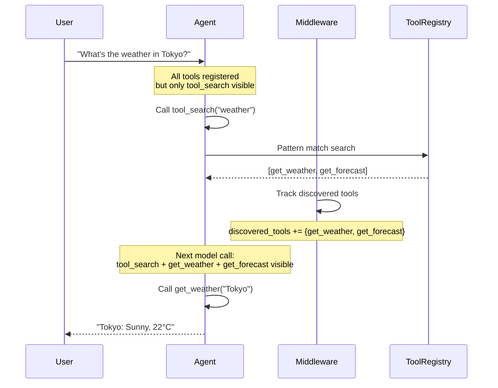
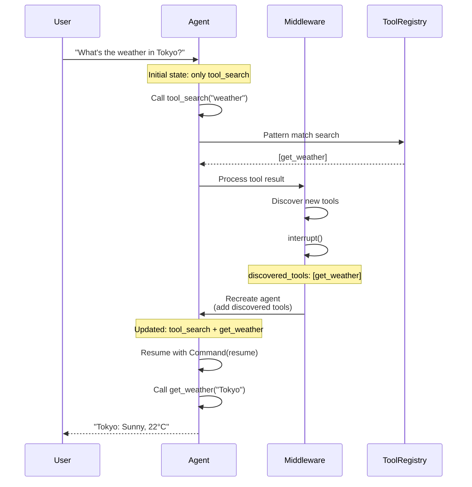
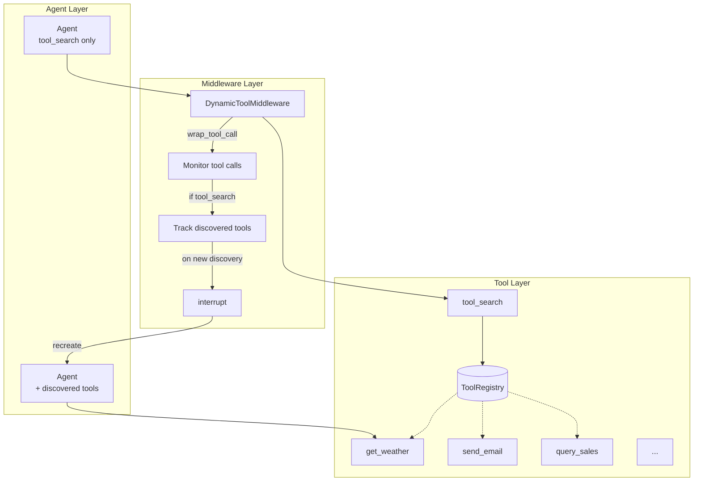
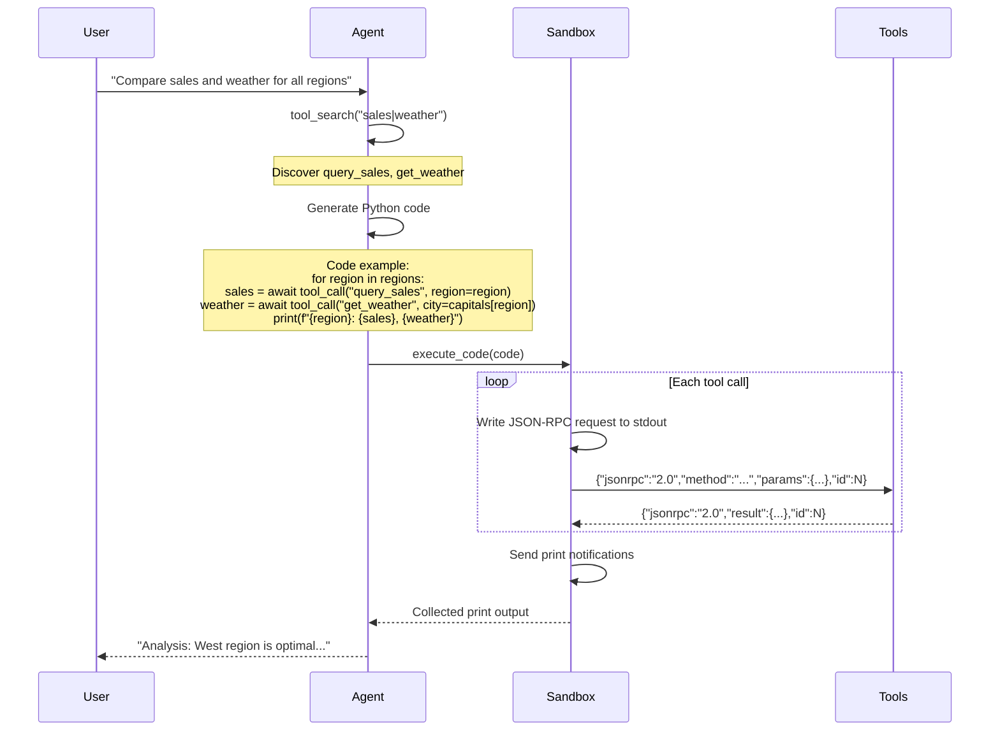
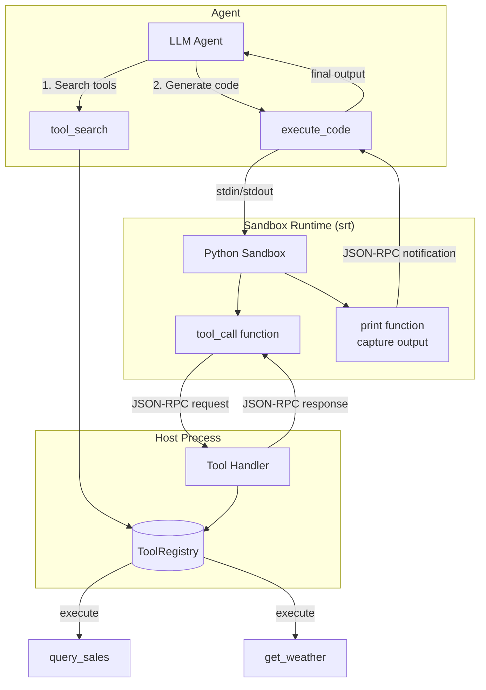
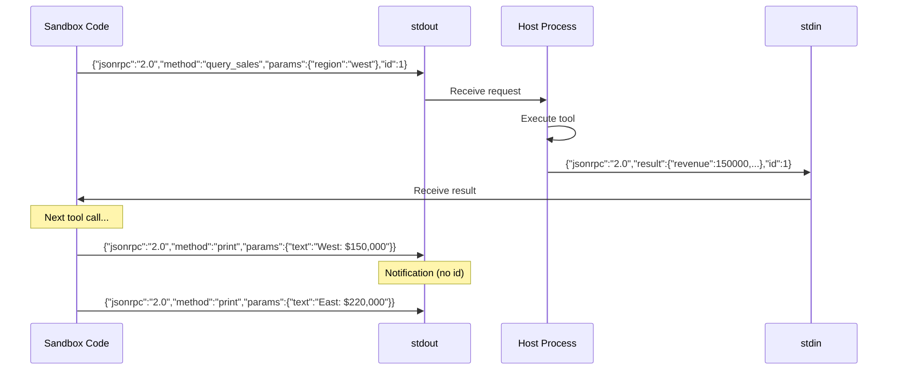

# Tool Patterns

Tool calling patterns for LLM agents.

## Tool Search

Dynamic tool discovery pattern for agents with many tools (30-50+).

### Problem

- **Context bloat**: All tool definitions consume tokens
- **Selection errors**: LLM struggles to choose the right tool

### Two Approaches

| Aspect | Filter Pattern | Interrupt Pattern |
|--------|---------------|-------------------|
| Complexity | Simpler | More complex |
| Token saving | Yes | Yes |
| Tool registration | All upfront | Dynamic |
| Use case | Known tool set | Truly dynamic tools |
| State management | Middleware state | Checkpointer required |
| Notebook | `tool-search-filter.ipynb` | `tool-search-interrupt.ipynb` |

---

### Filter Pattern

Register all tools upfront, use middleware to filter which tools are visible to the LLM.

**When to use**: Tool set is known at startup, just need to reduce context.

#### Key Points

1. **All tools registered**: `create_agent(tools=[tool_search, *ALL_TOOLS])`
2. **Middleware filters visibility**: `wrap_model_call` filters `request.tools`
3. **No interrupt needed**: Same agent instance throughout
4. **State in middleware**: `discovered_tools: set[str]` persists naturally

---

### Interrupt Pattern

Start with only `tool_search`, use middleware to interrupt and recreate agent with discovered tools.

**When to use**: Tools loaded from external sources, cannot enumerate upfront.

#### Components

#### Key Points

1. **ToolRegistry**: Holds all tools (name → BaseTool)
2. **tool_search**: Search tools by regex, return schemas
3. **DynamicToolMiddleware**: Monitor results via `wrap_tool_call`
4. **interrupt**: Pause on new discovery, recreate agent

#### Limitations

- **No dynamic tool injection**: LangGraph agents cannot add tools at runtime. The agent must be recreated with the new tool set.
- **Checkpointer required**: A shared `InMemorySaver` (or persistent checkpointer) is needed to preserve conversation state across agent recreation.
- **Interrupt/resume overhead**: Each tool discovery triggers an interrupt → recreate → resume cycle.

---

### Failed Approach: Middleware Tool Injection

See `dynamic-tools-failed.ipynb` for why injecting new `BaseTool` via middleware doesn't work.

**TL;DR**: Middleware can modify `request.tools`, but the tools node only knows about tools registered at `create_agent()` time. Injecting a tool the agent wasn't created with causes `ValueError: Middleware returned unknown tool names`.

**Exception**: `dict` format tools (Anthropic server-side tools like `web_search`) can be added dynamically because they execute server-side, not locally.

---

## Programmatic Tool Calling

Batch execute multiple tool calls to reduce API round-trips.

### Problem

- **Latency**: API round-trip for each tool call
- **Token overhead**: Intermediate results returned to model every time

### Solution

Agent generates Python code, executes in sandbox.
Batch multiple tool calls, return only final result.

### Architecture

### Communication Protocol (JSON-RPC 2.0)

### Benefits

| Aspect | Traditional | Programmatic |
|--------|-------------|--------------|
| API calls | N tools × round-trips | 1 round-trip |
| Tokens | All intermediate results | Final output only |
| Flexibility | Fixed flow | Loops, conditionals |

### Key Implementation Points

1. **srt (sandbox-runtime)**: Anthropic's sandbox execution environment
2. **tool_call()**: Function to invoke host tools from sandbox
3. **JSON-RPC 2.0**: Standard protocol over stdout/stdin (request with id, notification without id)
4. **print() capture**: Sent as JSON-RPC notification, collected by host

---

## Comparison

| Pattern | Problem | Solution |
|---------|---------|----------|
| Tool Search | Too many tools → context bloat | Dynamic discovery |
| Programmatic | Too many API calls → latency | Batch execution in sandbox |

These patterns solve different problems and can be used independently or together.

## References

- [Anthropic: Programmatic Tool Calling](https://platform.claude.com/docs/agents-and-tools/tool-use/programmatic-tool-calling)
- [sandbox-runtime](https://github.com/anthropic-experimental/sandbox-runtime)
